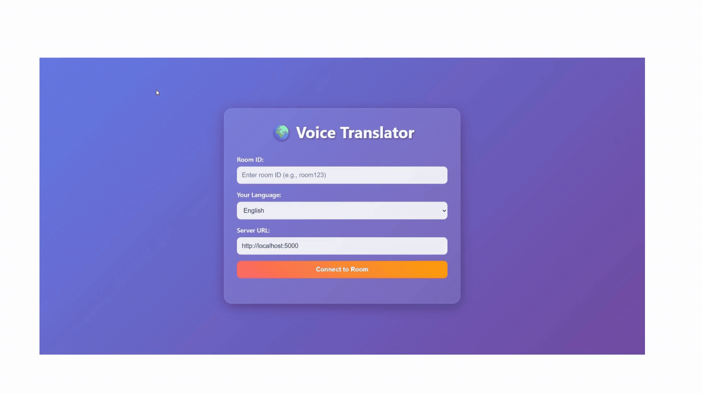

# 🌍 Real-time Voice Translator

A modular, real-time, multilingual voice translation system that transcribes, translates, and speaks your voice in another language — all in your browser.



---

## ✨ Features

- 🎹 Real-time voice-to-voice translation
- 🌐 12+ languages supported (DeepL + Hugging Face fallback)
- 🧠 Transcription via OpenAI Whisper
- 🕡 TTS with Edge TTS (Microsoft)
- 📡 Room-based real-time chat with Flask-SocketIO
- 💻 Clean HTML5 + responsive design frontend

---

## 📆 Project Structure

```
live-voice-translation/
├── backend/
│   ├── app.py
│   ├── config.py
│   ├── routes/
│   ├── socket/
│   ├── services/
│   └── utils/
├── frontend/
│   ├── index.html
│   ├── style.css
│   └── app.js
├── .env
├── Dockerfile
├── docker-compose.yml
└── README.md
```

---

## 🚀 Quick Start

### Prerequisites

- Python 3.8+
- FFmpeg installed
- DeepL API Key (or fallback to Hugging Face)
- CUDA (optional)

---

### 📦 1. Clone the Repository

```bash
git clone https://github.com/DovudAsadov/live-voice-translation.git
cd live-voice-translation
````

---

### ⚙️ 2. Install [`uv`](https://github.com/astral-sh/uv) (Python package & environment manager)

If you haven’t installed `uv` yet:

```bash
curl -LsSf https://astral.sh/uv/install.sh | sh
```

---

### 🧪 3. Set Up Python Environment

```bash
uv venv
source .venv/bin/activate
uv sync
```

---

### 🔐 4. Configure Environment Variables

Create a `.env` file in the project root:

```bash
echo "DEEPL_TOKEN=your_deepl_api_key" > .env
echo "OPENAI_TOKEN=your_openai_token" >> .env
```

> ⚠️ Make sure to use `>>` on the second line to **append** instead of overwrite.

---

### 🚀 5. Run the Backend Server

```bash
cd backend
python app.py
```

---

## 💪 Docker Support

The backend server can be containerized with Docker or orchestrated using Docker Compose.

### Build & Run with Docker

```bash
# Build Docker image
docker build -t call-translator .

# Run the container
docker run -p 5000:5000 \
    --env-file .env \
    --name call-translator \
    call-translator
```

### Using Docker Compose

```bash
# Start all services (backend, redis, nginx)
docker-compose up --build

# Stop services
docker-compose down
```

> Make sure to set your `DEEPL_TOKEN` in the `.env` file before running.

### Dockerfile
See [Dockerfile](./Dockerfile)

### docker-compose.yml
See [docker-compose.yml](./docker-compose.yml)

---

## 🔌 WebSocket API

**Client to Server**

- `join_room`
- `leave_room`
- `audio_data`

**Server to Client**

- `room_joined`
- `user_joined`
- `user_left`
- `translated_audio`

---

## 🔮 REST API

```bash
POST /translate        # Translate a single audio file
GET /health            # Check system health
```

---

## 🔒 Security

- Use HTTPS for production
- Store API keys in `.env`
- Add CORS and input validation
- Rate limit endpoints

---

## 📊 Performance

- GPU acceleration via CUDA
- Audio queue for concurrency
- Uses efficient WebM/Opus format
- Scales via Gunicorn or Compose

---

## 🔹 Supported Languages

| Code | Language    | TTS Supported? |
|------|-------------|----------------|
| en   | English     | ✅             |
| es   | Spanish     | ✅             |
| fr   | French      | ✅             |
| de   | German      | ✅             |
| it   | Italian     | ✅             |
| pt   | Portuguese  | ✅             |
| ru   | Russian     | ✅             |
| ja   | Japanese    | ✅             |
| ko   | Korean      | ✅             |
| zh   | Chinese     | ✅             |
| ar   | Arabic      | ✅             |
| hi   | Hindi       | ✅             |

---

## 🌍 Deployment

```bash
gunicorn --worker-class eventlet -w 1 -b 0.0.0.0:5000 app:app
```

Or use `docker-compose up`.

---

## 🔹 Roadmap

- [ ] Voice Activity Detection (VAD)
- [ ] Speaker identification
- [ ] Offline TTS support
- [ ] WebRTC transport
- [ ] PWA / Mobile App support

---

## 🤝 Contributing

1. Fork this repo
2. Create your feature branch
3. Commit with clear messages
4. Submit a pull request

---

## 📄 License

MIT License

- OpenAI Whisper — MIT
- Edge TTS — Microsoft API
- DeepL — Commercial use only

---

## 💬 Support

- Open an issue
- Submit a discussion
- Email the maintainer

